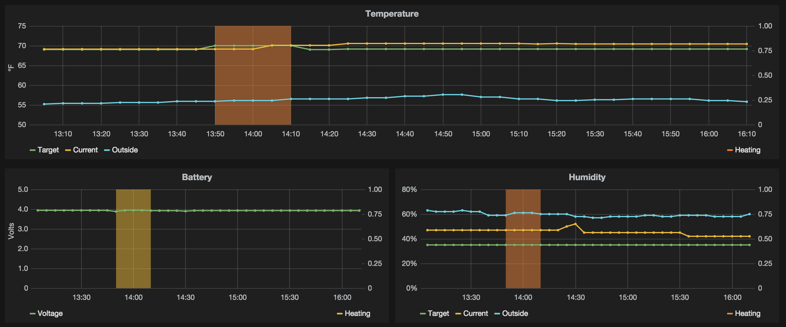

## NestFlux

Gets some basic info from your [Nest](https://nest.com/) thermostat and [Weather Underground](http://www.wunderground.com/) then inserts the
data into [InfluxDB](http://influxdb.com/).

Why? I like to query and mashup this stuff with other sources of information, like [Weather Underground](http://www.wunderground.com/).
You can then use tools like [Grafana](http://grafana.org/) to do all sorts of fun things.

This code is not super duper flexible or very clean. It was a weekend hack to get some data to play with.
Feel free to contribute!

## Usage

- Git clone the repo
- copy `settings.sh.example` to `settings.sh`
- Edit `settings.sh` putting your info into the variables
- Run `./bin/nestflux.sh` or put it in upstart/cron/etc
- Rejoice!

## Data Points

Each data points has the value stored in `value` inside of InfluxDB

- `nest.current_temperature` - Current temperature inside in Fahrenheit (nest)
- `nest.outside_temperature` - Current temperature outside in Fahrenheit (wunderground)
- `nest.target_temperature` - Temperature that it should be inside in Fahrenheit (nest)
- `nest.current_humidity` - Current humidity inside in percent (nest)
- `nest.outside_humidity` - Current humidity outside in percent (wunderground)
- `nest.target_humidity` - Relative humidity that it should be inside in percent (nest)
- `nest.heater_on` - Is the heater on or off in binary - 0/1 (nest)
- `nest.battery_level` - Nest battery voltage in volts (nest)
- `nest.learning_days_completed_heat` - Number of days the Nest has had to learn your nasty habits (nest)
- `nest.auto_away` - Is the system in auto away mode in binary - 0/1 (nest)

Here is an example InfluxDB query

`select value from "nest.current_temperature"`

## Grafana Dashboard

You can find the JSON for my Grafana dashboard pictured below [here](examples/grafana_dashboard.json)

